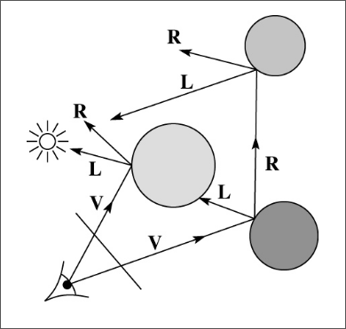

# Computergrafik
#### Michael Stenz


---

# Source

<div style="display: flex; line-height: 1; font-size: 2.1rem;">
<div>
<p>Presentation</p>


<a>https://stenz123.github.io/computergrafik-referat/</a>
</div>


<div style="padding-left: 20px;">
<p>Notes/Source</p>


<a>https://github.com/Stenz123/computergrafik-referat/</a>
</div>
</div>

---

# Allgemeines

## Was ist Computergrafik?
* Anzeige von Bildern/Daten
* Rendering von 3D-Modellen (3D -> 2D)
* Bearbeitung & Generieren von Bildern/Grafiken

---

# Was stellen wir dar?

* ## Daten
* 3D-Modelle (Videospiel, Film...)
* Vektorgrafiken
* Rastergrafiken (Bilder...)

---

# Gefahr bei der Rasterung


---
# Ohne Anti-Aliasing


---
# Mit Anti-Aliasing


---

# Anti-Aliasing Algorithmen

* **MSAA (Multisample Anti-Aliasing)**:
    - mehrere Farbwerte pro Pixel

* **SSAA (Supersample Anti-Aliasing)**:
    - Höhere Auflösung, dann runterskaliert

* **FXAA (Fast Approximate Anti-Aliasing)**:
    - Post-Processing-Filter (schnell)

* **TAA (Temporal Anti-Aliasing)**:
    - Nutzt vorherige Frames zur Glättung

---

# 3D-Modelle

- **Polygone**: Grundelemente von 3D-Modellen (hauptsächlich Dreiecke).
- **Vertices**: Eckpunkte mit Position
- **Splines**: Mathematische Kurven
- **Bézier-Kurven**: Kontrollpunkte definieren die Form und den Verlauf.


---

# (3D) Rendering Algorithmen

- Rendering: Umwandlung einer 2D/3D-Szene in ein Bild.
- Zwei Hauptkategorien:
    - **Echtzeit-Rendering**
    - **Offline-Rendering**

---

# Echtzeit-Rendering

- Bildrate: 20-120 FPS für flüssige Wiedergabe.
- Anwendungen: Videospiele, Simulationen, AR/VR.
- Unreal Engine, Unity...


---

# Grafikpipeline

- = Alle Schritte zum Rendern
- Nicht standardisiert
- Hängt von der Grafikkarten hersteller / Architektur ab.
- Standardisierte schnittstelle: OpenGL, Vulkan, Direct3D
<!-- Vulkan wurde als Nachfolger von OpenGL entwickelt und ist eine moderne, plattformübergreifende Grafik-API, die eine bessere Leistung und eine bessere Kontrolle über die Hardware bietet. -->

---

# Grafikpipeline
## Use cases
- Bildschirmschoner
- CAD
- Computerspiele
- Erweiterte Realität
- Simulationen (ASAMGpu)
- Virtuelle Realität
- VRML-Authoring

---

# Verwendung von OpenGL


---

# Zeichnen eines dreiecks

```c
glBegin(GL_TRIANGLES);
glColor3f(1.0f, 0.0f, 0.0f);
glVertex3f(-1.0f, -1.0f, 0.0f);
glVertex3f(1.0f, -1.0f, 0.0f);
glVertex3f(0.0f, 1.0f, 0.0f);
glEnd();
```

---

# Grafikpipeline
## Schritte


---

# Grafikpipeline
## 1) Application

* Läuft auf der CPU
* Berechnet:
    - Benutzerinteraktionen
    - Physik (z.B. Kollisionen)
    - Animationen

---

# Grafikpipeline
## Schritte


---

# Grafikpipeline
## 1) Application
* Läuft auf der CPU
* Berechnet:
    - Benutzerinteraktionen
    - Physik (z.B. Kollisionen)
    - Animationen

---

# Grafikpipeline
## 2) Geometry


---


# 2) Geometry
## Transformation
* **Modelltransformation:** Objekte im 3D-Raum positionieren und skalieren.
* **Kameratransformation:** Kamera im Raum bewegen und drehen.
* Anwendung von Matrizen für die Umrechnung von Koordinaten.

---

# 2) Geometry
## Lighting
* Berechnung der Beleuchtung basierend auf:
    - Lichtquellenposition
    - Materialeigenschaften
    - Kameraposition
* Beleuchtungsmodelle: Phong, Gouraud
* Bestimmt Farbe und Helligkeit jedes Punktes.

---

# 2) Geometry
## Projection
**Perspektivische Projektion:** Objekte in der Ferne erscheinen kleiner.


---

# 2) Geometry
## Projection

**Orthographische Projektion:** Objekte unabhängig von Entfernung gleich groß.


---

# 2) Geometry
## Projection

- Matrix zum skalieren nach der Projektion. Beispiel Perspektivische Projektion:

$\begin{pmatrix}
w & 0 & 0 & 0 \\
0 & h & 0 & 0 \\
0 & 0 & \frac{far}{near - far} & -1 \\
0 & 0 & \frac{near \cdot far}{near - far} & 0
\end{pmatrix}$

<!-- Der w wert bestimmt die breite des bildes, der h wert, die höhe. Die near und Far werte, sind hier wichtig um due Z-werte richtig zu skalieren. Für das Z Buffering -->

---

# 2) Geometry
## Clipping
- Objekte außerhalb des Frustum entfernen.
- Verwendung von Clipping-Planes, um nur sichtbare Objekte zu rendern. (vorne und hinten)
- Spart Rechenleistung und optimiert die Darstellung.


---

# Grafikpipeline
## 3) Rasterization
- Wandelt geometrische Primitives (Dreiecke, Linien, Punkte) in Pixel um.
- Jedes Fragment entspricht einem Pixel im Framebuffer.
- Framebuffer = 

---
# Grafikpipeline
## 3) Rasterization
- **Rasterization:** Wandelt geometrische Primitives (Dreiecke, Linien, Punkte) in Pixel um.
- Jedes Fragment entspricht einem Pixel im Framebuffer.
- Framebuffer = Teil des Grafikspeichers

---

# Z-Buffering

- **Z-Buffering:** Speichert den Tiefenwert jedes Pixels.
- Vergleicht Tiefenwerte, um sichtbare Objekte zu bestimmen.


---

# Grafikpipeline
## 4) Shading
- Berechnet Farbe & Schatten jedes Fragments.
- Unterschiedliche Arten:
    - **Vertex-Shader:** Transformation und Beleuchtung von Vertexen.
    - **Fragment-Shader:** Farbe & Textur jedes Pixels bestimmen.
- Shading-Techniken:
    - **Phong-Shading** = Glanzlichter
    - **Gouraud-Shading** = Farbverläufe

---


---

# Offline-Rendering

- Hohe Qualität, aber langsam
- Möglichkeit komplexerer Berechnungen (Caustics, Raytracing)
- Anwendungen: Filme, Werbung...
- Cinema 4D, Blender...


<!-- Avatar hatte ca eine eine Renderzeit von 8 Stunden pro Frame. 48 Fps, 3h 12min -->

---

# Raytracing
Ray (Strahl) Tracing (Verfolgen)
 
=> Simulation von einzelnen Lichtstrahlen.
- Realistische Schatten/Licht
- Simulation von Reflexionen
- Simulation von Lichtbrechung


---

# Raytracing
## Vereinfachtes Prinzip
Für jedes Pixel nimmt man den Durchschnitt der Strahlenfarben, die ihn treffen.

---

# Raytracing - Vorwärtsverfolgung
* Problem:
  * MILLIONEN von unnötigen Lichtstrahlen 


---

# Raytracing - Rückwärtsverfolgung
* Startet beim Auge und verfolgt den Strahl zurück.
* Berechnet die Farbe des Strahls basierend auf den Objekten, die er trifft.

---

# Raytracing - Shadow Ray

- Für alle sichtbaren Punkte wird ein Shadow Ray für jede Lichtquelle gesendet.
- Überprüft, ob der Punkt beleuchtet wird / verdeckt.


--- 

# Raytracing - Reflextion

- Weiterverfolgen von Lichtstrahlen
- Ambient Occlusion (Indirekte Beleuchtungen)

---

# Raytracing - Brechung

- Wenn ein Mediumswechsel passiert, wird einfach ein weiterer gebrochener Strahl verfolgt
- Wie in der Physik

---

# Whitted Raytracing algorithm
- Turner Whitted 1980


---

```
function traceImage (scene) {
    for each pixel (i,j) in image { // i und j sind die Indexe (Koord.)
    }
}
```
---
```
function traceImage (scene) {
    for each pixel (i,j) in image { // i und j sind die Indexe (Koord.)
        A = pixelToWorld(i,j) // Absolute Position
        d = (A - P)/|| A – P|| // Richtung des Strahls
    }
}
```
---
```
function traceImage (scene) {
    for each pixel (i,j) in image { // i und j sind die Indexe (Koord.)
        A = pixelToWorld(i,j) // Absolute Position
        d = (A - P)/|| A – P|| // Richtung des Strahls
        I(i,j) = traceRay(scene, P, d)
    }
}
```
---
```
function traceImage (scene) {
    for each pixel (i,j) in image { // i und j sind die Indexe (Koord.)
        A = pixelToWorld(i,j) // Absolute Position
        d = (A - P)/|| A – P|| // Richtung des Strahls
        I(i,j) = traceRay(scene, P, d)
    }
}
```

```
function traceRay(scene, P, d):
    (t, N, mtrl) <- scene.intersect (P, d) // t Abstand, N Normale, mtrl Material
    Q <- ray (P, d) evaluated at t // Q treffPUNKT
    I = shade(mtrl, scene, N, Q, -d)
    return I
end function
```

---

```
function shade(mtrl, scene, Q, N, d){
    //Startlichtintensität des Objekts
    I <- mtrl.k_e + mtrl.k_a * I_La // k_e Emmisionskomponent, k_a Ambientskomponente, I_La  Umgebungslichts
    // I ist die Gesamthelligkeit an Punk Q
    return I
}
```
---

```
function shade(mtrl, scene, Q, N, d){
    //Startlichtintensität des Objekts
    I <- mtrl.k_e + mtrl.k_a * I_La // k_e Emmisionskomponent, k_a Ambientskomponente, I_La  Umgebungslichts
    // I ist die Gesamthelligkeit an Punk Q
    for each light source L do {
        atten = L -> distanceAttenuation(Q) // Dämpfung des Lichts
        I <- I + atten * (diffuse term + specular term) 
    }
    return I
}
```

---

```
function shade(mtrl, scene, Q, N, d){
    //Startlichtintensität des Objekts
    I <- mtrl.k_e + mtrl.k_a * I_La // k_e Emmisionskomponent, k_a Ambientskomponente, I_La  Umgebungslichts
    // I ist die Gesamthelligkeit an Punk Q
    for each light source L do {
        atten = L -> distanceAttenuation(Q) // Dämpfung des Lichts
        I <- I + atten * (diffuse term + specular term) 
    }
    return I
}
```


---

```
function PointLight::shadowAttenuation(scene, P){
    d = (this.position - P).normalize // *Siehe formel unten    
    (t, N, mtrl) <- scene.intersect(P, d) // Abstand, Normalvektor, Material
    Compute t_light // Abstand zur Lichtquelle
    if (t < t_light) { // Wenn verdekt
        atten = (0, 0, 0) // Dann ist der Punkt im Schatten
    else
        atten = (1, 1, 1) // Sonst ist der Punkt beleuchtet
    }
    return atten
}
```
\* $\frac{L_{P} - P}{|L_{P} - P|}$


---

```
function shade(mtrl, scene, Q, N, d){
    I <- mtrl.k_e + mtrl.k_a * I_La
    for each light source L do {
        //Mit dem erkebnis von shadowAttenuation multiplizieren
        atten = L -> distanceAttenuation(Q) * shadowAttenuation(scene, Q) 
        I <- I + atten * (diffuse term + specular term) 
    }
    return I
}
```
---

```
function shade(mtrl, scene, Q, N, d){
    I <- mtrl.k_e + mtrl.k_a * I_La
    for each light source L do {
        //Mit dem erkebnis von shadowAttenuation multiplizieren
        atten = L -> distanceAttenuation(Q) * shadowAttenuation(scene, Q) 
        I <- I + atten * (diffuse term + specular term) 
    }
    return I
}
```


---

```
function traceRay(scene, P, d) {
   (t, N, mtrl) <- scene.intersect (P, d)
   Q <- ray (P, d) evaluated at t
   I = shade(scene, mtrl, Q, N, -d)
   R = reflectDirection(N, -d) // Berechnung des reflektierten Strahls
   I <- I + mtrl.k_r * traceRay(scene, Q, R) // Rekursiev
   return I
}
```



* Das fertige Beispiel mit Brechung befindet sich in den Notizen: https://github.com/Stenz123/computergrafik-referat/

---

# Danke für Eure Aufmerksamkeit


---

Quellen:

https://developer.nvidia.com/blog/generating-ray-traced-caustic-effects-in-unreal-engine-4-part-1/

https://developer.nvidia.com/gpugems/gpugems/part-iii-materials/chapter-16-real-time-approximations-subsurface-scattering

https://viscircle.de/wie-sie-sich-einen-ueberblick-ueber-die-rendering-pipeline-machen-koennen/

[An Introduction to Ray Tracing - Anrew S. Glassner](https://www.realtimerendering.com/raytracing/An-Introduction-to-Ray-Tracing-The-Morgan-Kaufmann-Series-in-Computer-Graphics-.pdf)

[University Washington - Raytracing](https://courses.cs.washington.edu/courses/cse457/11au/lectures/markup/ray-tracing-markup.pdf)
