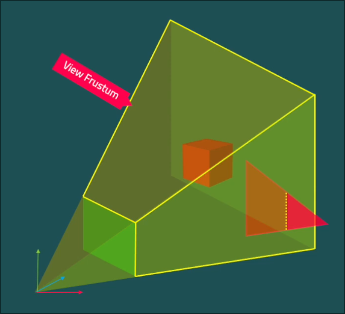

# Computergrafik
#### Michael Stenz


---

# Allgemeines

## Was ist Computergrafik?
* Anzeige von Bildern/Daten
* Rendering von 3D-Modellen (3D -> 2D)
* Bearbeitung & Generieren von Bildern/Grafiken

---

# Was stellen wir dar?

* ## Daten
* 3D-Modelle (Videospiel, Film...)
* Vektorgrafiken
* Rastergrafiken (Bilder...)

---

# Gefahr bei der Rasterung


---
# Ohne Anti-Aliasing


---
# Mit Anti-Aliasing


---

# Anti-Aliasing Algorithmen

* **MSAA (Multisample Anti-Aliasing)**:
    - mehrere Farbwerte pro Pixel

* **SSAA (Supersample Anti-Aliasing)**:
    - Höhere Auflösung, dann runterskaliert

* **FXAA (Fast Approximate Anti-Aliasing)**:
    - Post-Processing-Filter (schnell)

* **TAA (Temporal Anti-Aliasing)**:
    - Nutzt vorherige Frames zur Glättung

---

# 3D-Modelle

- **Polygone**: Grundelemente von 3D-Modellen (hauptsächlich Dreiecke).
- **Vertices**: Eckpunkte mit Position
- **Splines**: Mathematische Kurven
- **Bézier-Kurven**: Kontrollpunkte definieren die Form und den Verlauf.


---

# (3D) Rendering Algorithmen

- Rendering: Umwandlung einer 2D/3D-Szene in ein Bild.
- Zwei Hauptkategorien:
    - **Echtzeit-Rendering**
    - **Offline-Rendering**

---

# Echtzeit-Rendering

- Bildrate: 20-120 FPS für flüssige Wiedergabe.
- Anwendungen: Videospiele, Simulationen, AR/VR.
- Unreal Engine, Unity...


---

# Grafikpipeline

- = Alle Schritte zum Rendern
- Nicht standardisiert
- Hängt von der Grafikkarten hersteller / Architektur ab.
- Standardisierte schnittstelle: OpenGL, Vulkan, Direct3D
<!-- Vulkan wurde als Nachfolger von OpenGL entwickelt und ist eine moderne, plattformübergreifende Grafik-API, die eine bessere Leistung und eine bessere Kontrolle über die Hardware bietet. -->

---

# Grafikpipeline
## Use cases
- Bildschirmschoner
- CAD
- Computerspiele
- Erweiterte Realität
- Simulationen (ASAMGpu)
- Virtuelle Realität
- VRML-Authoring

---

# Verwendung von OpenGL


---

# Zeichnen eines dreiecks

```c
glBegin(GL_TRIANGLES);
glColor3f(1.0f, 0.0f, 0.0f);
glVertex3f(-1.0f, -1.0f, 0.0f);
glVertex3f(1.0f, -1.0f, 0.0f);
glVertex3f(0.0f, 1.0f, 0.0f);
glEnd();
```

---

# Grafikpipeline
## Schritte


---

# Grafikpipeline
## 1) Application

* Läuft auf der CPU
* Berechnet:
    - Benutzerinteraktionen
    - Physik (z.B. Kollisionen)
    - Animationen

---

# Grafikpipeline
## Schritte


---

# Grafikpipeline
## 1) Application
* Läuft auf der CPU
* Berechnet:
    - Benutzerinteraktionen
    - Physik (z.B. Kollisionen)
    - Animationen

---

# Grafikpipeline
## 2) Geometry


---


# 2) Geometry
## Transformation
* **Modelltransformation:** Objekte im 3D-Raum positionieren und skalieren.
* **Kameratransformation:** Kamera im Raum bewegen und drehen.
* Anwendung von Matrizen für die Umrechnung von Koordinaten.

---

# 2) Geometry
## Lighting
* Berechnung der Beleuchtung basierend auf:
    - Lichtquellenposition
    - Materialeigenschaften
    - Kameraposition
* Beleuchtungsmodelle: Phong, Gouraud
* Bestimmt Farbe und Helligkeit jedes Punktes.

---

# 2) Geometry
## Projection
**Perspektivische Projektion:** Objekte in der Ferne erscheinen kleiner.


---

# 2) Geometry
## Projection

**Orthographische Projektion:** Objekte unabhängig von Entfernung gleich groß.


---

# 2) Geometry
## Projection

- Matrix zum skalieren nach der Projektion. Beispiel Perspektivische Projektion:

$\begin{pmatrix}
w & 0 & 0 & 0 \\
0 & h & 0 & 0 \\
0 & 0 & \frac{far}{near - far} & -1 \\
0 & 0 & \frac{near \cdot far}{near - far} & 0
\end{pmatrix}$

<!-- Der w wert bestimmt die breite des bildes, der h wert, die höhe. Die near und Far werte, sind hier wichtig um due Z-werte richtig zu skalieren. Für das Z Buffering -->

---

# 2) Geometry
## Clipping
- Objekte außerhalb des Frustum entfernen.
- Verwendung von Clipping-Planes, um nur sichtbare Objekte zu rendern. (vorne und hinten)
- Spart Rechenleistung und optimiert die Darstellung.



---

# Grafikpipeline
## 3) Rasterization
- Wandelt geometrische Primitives (Dreiecke, Linien, Punkte) in Pixel um.
- Jedes Fragment entspricht einem Pixel im Framebuffer.
- Framebuffer = 

---
# Grafikpipeline
## 3) Rasterization
- **Rasterization:** Wandelt geometrische Primitives (Dreiecke, Linien, Punkte) in Pixel um.
- Jedes Fragment entspricht einem Pixel im Framebuffer.
- Framebuffer = Teil des Grafikspeichers

---

# Z-Buffering

- **Z-Buffering:** Speichert den Tiefenwert jedes Pixels.
- Vergleicht Tiefenwerte, um sichtbare Objekte zu bestimmen.


---

# Grafikpipeline
## 4) Shading
- Berechnet Farbe & Schatten jedes Fragments.
- Unterschiedliche Arten:
    - **Vertex-Shader:** Transformation und Beleuchtung von Vertexen.
    - **Fragment-Shader:** Farbe & Textur jedes Pixels bestimmen.
- Shading-Techniken:
    - **Phong-Shading** = Glanzlichter
    - **Gouraud-Shading** = Farbverläufe

---


---

# Offline-Rendering

- Hohe Qualität, aber langsam
- Anwendungen: Filme, Werbung...
- Cinema 4D, Blender...


---

